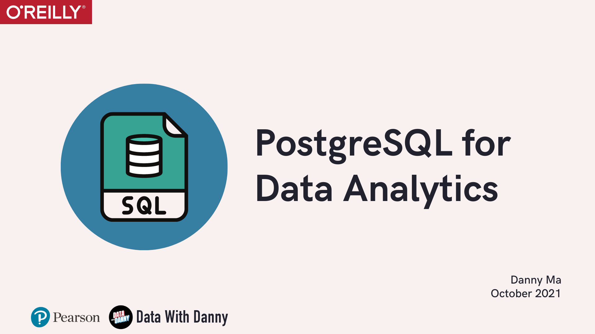

    

---

# PostgreSQL for Data Analytics

You can find all of the content and slides for Danny Ma's live training [SQL and PostgresSQL for Data Analytics](https://learning.oreilly.com/live-events/sql-and-postgresql-for-data-analytics/0636920061990/0636920061989/) held on the O'Reilly platform on the 5th of October 2021!

# Table of Contents

- [🦊 Katacoda Scenarios](#scenarios)
- [📚 Presentation Slides](#slides)
- [🔥 PostgreSQL Super Quick Cheatsheet](#cheatsheet)
- [🙏 Next Steps](#thank-you)
- [😎 About the Author](#about-danny)

# 🦊 Katacoda Scenarios 

The accompanying SQL Simplified Katacoda course created by Danny Ma to support this live training is also available on the O'Reilly platform!

## SQL Simplified Course

* [Scenario 1: Basic Data Analysis Techniques](https://learning.oreilly.com/scenarios/sql-simplified-basic/9780137604333X018/)
* [Scenario 2: Aggregate Functions for Data Analysis](https://learning.oreilly.com/scenarios/sql-simplified-aggregate/9780137604333X019/)
* [Scenario 3: Understanding Case When Statements](https://learning.oreilly.com/scenarios/sql-simplified-understanding/9780137604333X020/)
* [Scenario 4: Operating Window Functions](https://learning.oreilly.com/scenarios/sql-simplified-operating/9780137604333X021/)
* [Scenario 5: Using Table Joins](https://learning.oreilly.com/scenarios/sql-simplified-using/9780137604333X022/)

# 📚 Presentation Slides 

You can also see the presentation slides for the live training [here!](https://github.com/datawithdanny/postgresql-for-data-analytics/tree/main/content/postgresql-for-data-analytics.pdf)

# 🔥 PostgreSQL Super Quick Cheatsheet 

You can also click on the banner below to view Danny's PostgreSQL Super Quick Cheatsheet he's created for this live training.

This cheatsheet is supposed to be used as a super quick reference - it is full of code examples which you can easily copy and paste into your SQL queries!

---

# Thank You & Next Steps 

Thank you for checking out this ! If you enjoyed this live training or you've found this repo on Danny's GitHub - please feel free to share this with your friends and leave a star! ⭐

Here are some ways you can support the author and the Data With Danny team below 🙏

## Data With Danny Virtual Data Apprenticeship

 

If you're interested in learning valuable data science skills with Danny directly - you can checkout the [Data With Danny](https://www.datawithdanny.com) website for more details!

Join our private student community with over 1,000 data professionals, join a local study group, get help from our team of 12+ data mentors and learn more about our personalized mentorship initiatives!

The 1st part of the Data With Danny program is Serious SQL - if you've enjoyed this live training and the SQL Simplified Katacoda course at O'Reilly, you won't want to miss this course!

Our first live SQL training cohort begins in November 2021 - you can gain all access to course content, recorded videos, our private Discord and more for a one off payment of only $49 - find out more [here!](https://www.datawithdanny.com/courses/serious-sql)

## 8 Week SQL Challenge Case Studies

 

Want to test your SQL skills and tackle 8 realistic SQL case studies and get access to a collection of free SQL learning resources?

Join the Data With Danny [8 Week SQL Challenge](https://www.8weeksqlchallenge.com/getting-started) for free today!

Solve all 8 realistic SQL case studies designed to simulate real work scenarios and interview questions across multiple analytics domains including customer analytics, digital, banking, retail and subscriptions!

## About the Author: Danny Ma 

Danny is the Chief Data Mentor at Data With Danny and the Founder & CEO of Sydney Data Science, a boutique data consultancy based out of Sydney, Australia 🇦🇺

After spending the last 10 years working in almost every single role in the data ecosystem, Danny is now focused on solving difficult problems at scale re-imagining data education and recruitment, and mentoring the next generation of data professionals.

He provides specialist data consultancy services:

* Digital customer analytics and experimentation
* Data and machine learning strategy
* Data engineering and systems design
* Team building for analytics and data science functions
* Technical training for practitioners and management

Danny is a regular speaker at global data conferences, meetups and podcasts where he shares the importance of mentorship for all data professionals. He is
also a technical author and instructor for O'Reilly.

Danny believes that he is living proof that dispels the myth that you need higher level education to be successful in the data science space,
and he wants to share his experiences with others so they can do the same.